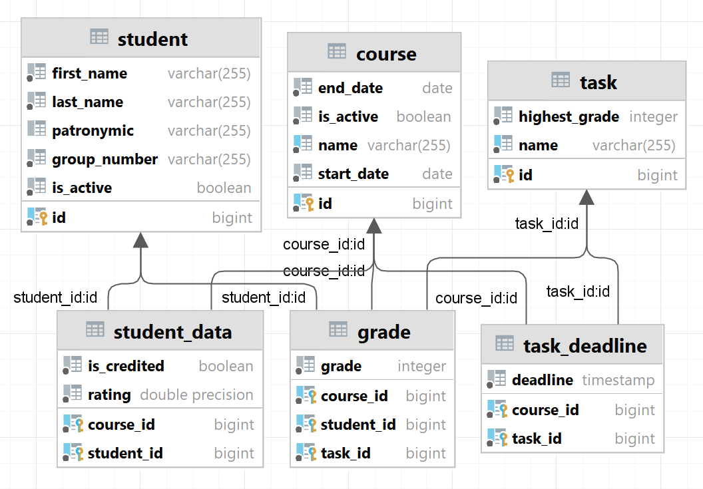

# SmallBackendService
Тестовое задание по разработке сервиса для учета результатов обучающихся в соответствии с 
планом учебного курса и расчету рейтинга обучающегося по его оценкам  
## Важное замечание
Расчет рейтинга сделан с отклонением от задания!  
Я взял на себя смелость сделать расчет на основе всех оценок за задания независимо от дедлайна.  
В задании сказано, что рейтинг надо считать по заданиям у которых дата и время (дедлайн) раньше текущего.  
Я посчитал такой подход в корне не верным.
Потому что в таком случае рейтинг зависит от времени, и следовательно, не несет никакой информации.
И непонятно как рассчитывать факт зачтения курса.
При этом все приложение еще должно отслеживать дедлайны и пересчитывать рейтинги.
### Архитектура проекта
Сервис представляет собой REST API и основан на Spring Boot 2.7.6 и системе сборки maven
### Сборка проекта
```mvn clean install```  
Перед сборкой проекта необходимо заполнить данные для подключения к БД (поля url, username и password) в файле application.yaml
### Запуск проекта локально
```mvn spring-boot:run```
### Описание функциональности
Сервис обладает следующей функциональностью:  
#### Работа с курсом:  
`POST /course/addCourse` - добавить курс;  
`GET /course/findAllCourses` - получить список всех курсов;  
`GET /course/findCourseById` - найти курс по его id;  
`GET /course/findCourseByName` - найти курс по его названию;  
`PUT /course/updateCourseById` - обновить данные курса;  
`PUT /course/deactivateCourseById` - деактивировать курс.
#### Работа со студентом:  
`POST /student/addStudent` - добавить студента;  
`GET /student/findAllStudents` - получить список всех курсов;  
`GET /student/findAllStudentsByGroupNumber` - получить список студентов по номеру группы;  
`GET /student/findAllStudentsByFullName` - получить список студентов по полному имени;  
`GET /student/findStudentById` - найти студента по его id;  
`PUT /student/updateStudentById` - обновить данные студента;  
`PUT /student/deactivateStudentById` - деактивировать студента.  
#### Работа с заданиями:
`POST /task/addTask` - добавить задание;  
`GET /task/findAllTasks` - получить список всех заданий;  
`GET /task/findTaskById` - найти задание по его id;  
`GET /task/findTaskByName` - найти задание по его названию;  
`GET /task/updateTaskById` - обновить данные задания.
#### Связь задания и курса:
`POST /taskDeadline/linkTaskToCourse` - добавить задание в курс и установить ему дедлайн;  
`GET /taskDeadline/findTask` - найти задание с информацией о дедлайне;  
`GET /taskDeadline/findTasksByCourseId` - получить список заданий добавленных в курс;  
`PUT /taskDeadline/updateDeadline` - обновить дедлайн курса;  
`DELETE /taskDeadline/unlinkTaskFromCourse` - убрать задание из курса;  
#### Связь студента и курса:  
`POST /studentData/linkCourseToStudent` - добавить студента к курсу;  
`GET /studentData/findStudentData` - получить данные студента (средний балл и зачет/незачет курса);  
`GET /studentData/findStudentDataByStudentId` - получить данные студента по всем курсам в которые он добавлен;  
`GET /studentData/findStudentsByCourseId` - получить список студентов добавленных на курс;  
`GET /studentData/findCoursesByStudentId` - получить список курсов в которые добавлен студент;  
`DELETE /studentData/unlinkCourseFromStudent` - исключить студента из курса.  
#### Выставление оценок:  
`POST /studentGrade/addGrade` - выставить оценку студенту;  
`GET /studentGrade/getGrades` - получить список оценок студента на курсе;  
`GET /studentGrade/updateGrade` - изменить оценку.  
#### Более подробная информация доступна в openapi-ui.
### База данных  
Используется база данных PosgreSQL  
Структура базы данных:  

### Миграция базы данных
Для отслеживания, управления и применения изменений схемы базы данных использована библиотека liquibase.
### CI/CD
В качестве CI/CD используется GithubAction.  
При коммите в любую ветку будет запущен процесс сборки сервиса.
### API documentation
Для автоматической генерации API документации использована библиотека springdoc-openapi v1.6.12.
### Docker
В репозитории хранится Dockerfile для упаковки сервиса в образ на основе openjdk:17-alpine.  
### Что еще необходимо сделать  
Добавить JUnit тесты.  

